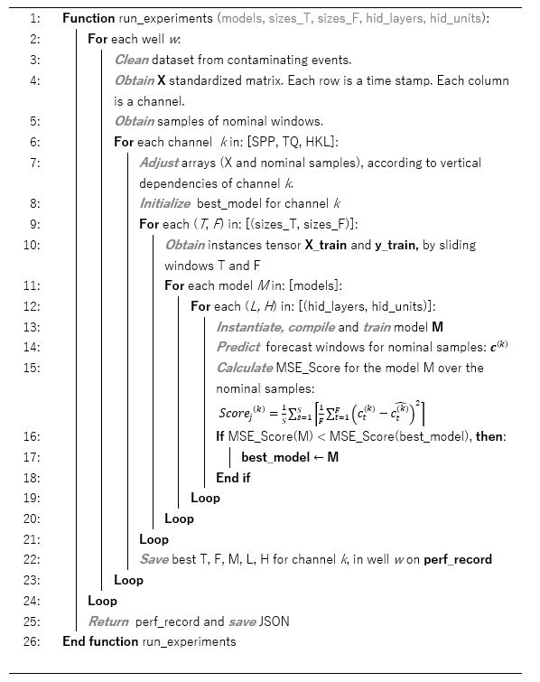

<h1> Proposed Methodology for Building Drilling Anomalies Predictors </h1> 

By Abraham Montes. 2021
 
<a href="https://repository.javeriana.edu.co/handle/10554/59135">Complete work repo (in spanish)</a>

## Executive Summary

This code is an application a proposed methodology for building anomaly predictors in the drilling operation. It parts from feature selection and dataset construction, and then divides the problem into: 1) Prediction of nominals and 2) Classification of contrasts. The code presents a test of this workflow on several time series from distinct wells in the Colombian foothills. In this specific application, it proofed to be capable of leading to: 1) Robust predictors of nominals (measured with spread statistics) and 2) Robust classifiers (measured with classification performance indicators from the confussion matrix). 

## Theory

The proposed methodology to build the predictor is summarized in the following schematic: 
  
 
&emsp;&emsp;&emsp;&emsp;&emsp;&emsp;&emsp;&emsp; *Figure 1. Workflow schematic*
  
This methodology uses CRISP-DM as a general framework, but was built specifically for building a pipe sticking predictor for the Colombian foothills. 

Figure 1 shows the schematic of the methodology proposed. It parts from a rigorous study of the problem of interest, i.e., the anomalous event sought to be predicted. Then a sequence of modules logically ordered allows building the predictor, with some iterative recursion to the starting points. 
 
    

The construction of the predictor machine is based on the problem division approach (prediction of nominal streams and classification of contrasts). In summary, it classifies time windows into positive (anomalous) or negative (nominal) classes based on their contrast with the predicted nominal windows. The contrast measures are also called outliers scores, or anomaly grade. An actual nominal window is expected to produce low contrast with the predicted window. Conversely, an anomalous window is expected to generate high contrast. 
 
    

These windows should be selected near the actual positive cases, so the predictor machine as a whole learns to identify patterns that warn the driller of the imminent occurrence of such events. This window will be referred to as forecast window. Next, these modules will be explained.
    

### Stages
<ol>
    <strong><li>E.D.A.: </strong>

    This module involves the foundational task for the entire process. It focuses on understanding the problem and seeks to obtain the dimensions of the feature vectors that will feed the nominal streams predictor. It is important to account for horizontal and vertical correlations. i.e., correlation across time on each channel (or sensor read-ing), and correlation between channels, as suggested by <a href="https://link.springer.com/book/10.1007/978-3-319-47578-3">Aggarwal, 2017</a>. 
 

To explore vertical and horizontal correlations, it is useful to build sparse matrices with Pearson correlation factors. For instance, it is evident (both physically and statistically) that to build a nominal predictor for the pressure channel (SPP), it is necessary to include the flow rate (GPM) as one of the dimensions of the feature vector. 

 

A sparse matrix with the adjacent time steps in a channel allows to visually find autocorrelations. However, autoregression methods need to follow such an initial approach.  Carrying over a principal component analysis (PCA) can be also useful, as it would allow to find the dimensions with the major fraction of the variance.

 

This module also seeks to select the most relevant channels (RC) for the anomalous event prediction. Over these channels the contrast will be measured. This can be done empirically, exploring the data surrounding the anomalous events and identifying anomalies per channel, or automatically, by using an optimization algorithm (such as any metaheuristic approach). It is noteworthy that the methodology on figure 1 proposes an iteration back to this stage after the nominals prediction and the contrast classification modules. If the performance of the system is poor, a new set of RC can be selected. Hence, this selection of RC becomes part of a global search space.

 

Finally, it is recommended to include derived features. In the case of anomalous events in drilling operations, especially when dealing with collective anomalies, it is important to account for the trends among the whole set of channels, more than the time dependency of each channel alone. One way to capture this, is to calculate the discrete derivatives by using the left truncated version of the Taylor series. For instance, for channel i, the first discrete derivative at time t can be calculated as:
 

$$
\left[ \frac{d\bar{S}^{(k)}}{dx} \right]_t = \frac{3{s_t}^{(k)} - 4{s_{t-1}}^{(k)} + {s_{t-2}}^{(k)}}{2h}
$$

 

Where $h$ is the time step. e.g., in the case of a data stream with 0.1 Hz frequency, then $h=10$ seconds.

 

</li>
<strong><li>Time window sliding: </strong>

This module is intended to build the instances for training the nominal predictors. For this, it is necessary to select a forecasting method. The literature reports 3 different methods for doing so: One step ahead, several steps ahead, and several steps by predicting with predictions. In the first one, the model captures the time dependency of the variable and predicts only the channel’s value one time step ahead. In the second, the model learns to predict several steps ahead, i.e., a forecast window. In the latter, the model predicts one step ahead at first, and then that prediction becomes part of the feed for a next prediction. When the model predicts the next value, it becomes again part of the feed stream and so forth. This type of forecasting is commonly used in stocks applications (<a href="https://www.elsevier.com/books/applied-time-series-analysis/mills/978-0-12-813117-6">Mills, 2019</a>). 
 

It is noteworthy that the first approach would not be useful if the stream frequency is high (more than 0.03 Hz). This is because the forecast window would not be sufficiently wide for the crew to react and prevent the anomalous event from happening. Moreover, the third option usually produces unstable models in which only a few steps ahead are correctly predicted and then the model diverges (<a href="https://www.oreilly.com/library/view/hands-on-machine-learning/9781491962282">Géron, 2019</a>). Hence, the second approach is suggested. 
 

To build the instances set, given the second forecasting approach, 2 window sizes are selected (the feed window, $T$, and the forecast window, $F$) and slid over the dataset. These windows are contiguous. Each sliding step extracts each of the instances. Hence, the resultant tensor has dimensions $N×T×D$, where $T$ is the size of the feed window, $D$ is the number of channels, and N is the number of times the windows were slid and is equal to $X-T-F$, where $X$ is the number of time stamps in the dataset, and $F$ the size of the forecast window. It is worth to mention that each RC has its own tensor, since each has different features. Figure 2 illustrates this procedure.
 

 

*Figure 2. Time windows sliding to build the instances tensor for the prediction module. The feed window is slid over the feature channels for the RC (in this case the channel 0). The forecast window accounts for the RC alone. Once the sliding is finished, a tensor of size* $N\times T\times D$ *and a matrix* $N\times F$ *are obtained.*

 

</li>
<strong><li>Nominals prediction: </strong>

This module seeks to find the best nominal predictor per RC and well. It is worth to mention that it also finds the best sizes of feed and forecast window, since the nomi-nal predictor’s architecture depends on both. 
 

Since this module is intended to reproduce the nominal streams, the data must be free of “contaminant” events. i.e., anomalous events that could bias the predictor. 
 

For forecasting, regression models can be used to capture the horizontal and vertical correlation of each channel and with other channels. For time series with monotonic trends, or some degree of seasonality (i.e., exhibiting cycles over long periods of time), linear regression is sufficient and accurate to reproduce the time series of each channel under nominal conditions. However, in highly complex contexts, prediction models that capture nonlinear regressions must be used. An approximator of func-tions by excellence is neural networks. In addition, recurrent networks are particularly suitable for data with temporal dependency thanks to the ”recurrence” within the graph.  
 

To use recurrent networks as nominal predictors in the context of anomalous events detection in drilling operations, the topology must be as shown in figure 3. The input instances will be matrices of size $T×D$, and there will be $F$ output neurons, representing the selected size of the forecast window.  
 

Recurrent networks are not the only way of capturing such temporal dependency. However, their use is strongly recommended. The suitability of each predictor is measured on randomly selected nominal windows by calculating the mean absolute percentage error (MAPE). As shown in figure 1, if the MAPE score shows that the predictor is poor, then the method proposes the iteration back to E.D.A. 
 

To summarize, in this module a search is carried out, being the search space: 
<ul>
<li> Prediction model (recurrent networks are strongly recommended given their suitability to deal with temporal adjacency). </li>
<li>	Hyperparameters of the prediction model.</li>
<li>	Feed window size.</li>
<li>	Forecast window size.</li>
</ul> 
This search can be executed exhaustively, which would imply considerably high computation time, especially for large datasets. There are 2 proposed alternatives to deal with time complexity: <ul>  
<li>	Parallel or distributed processing. </li>
<li>	Use of heuristics (such as genetic algorithms). </li>
</ul>
 

 

*Figure 3. Topology of the recurrent predictor to be used for predicting nominal streams on each RC. The input instances are* $T \times D$ *, where* $T$ *is the size of the feed window selected and* $D$ *is the number of channels. The number of output neurons is* $F$ *, which is the selected size of the forecast window.*

 

 
</li>
<strong><li>Contrast classification: </strong>

This module parts from the best nominal predictor for each channel and each well. With this, the selected outlier scores are calculated for sampled positive (anomalous) and negative (nominal) windows, on the RC. Finally, with all the measured samples, a classifier is trained to find the decision boundary between anomalous and nominal in terms of the RC.  
 

It is noteworthy that the outlier scores are part of the search space. If the classifier performs poorly, then an iteration back to E.D.A. needs to be done so continuously search through different RC, different features for their predictions, or different outlier scores. In this methodology, we recommend 3 basic scores: 
 
<ul>
<li>

<strong>Mean square error (MSE): </strong> 
It allows capturing the deviation from the nominal character in the window, highlighting peaks and collective anomalies by squared powering. For a predicted forecast window  $\bar{F}$  and, the MSE is calculated as:  
 

$$
MSE^{(k)} = \frac{1}{F} \sum_{t=1}^{F} \left (\delta_t^{(k)} \right)^2
$$

Where  $ \delta_t^{(k)}={c_{t,True}}^{(k)}-{\hat{c}_{t}}^{(k)} $  ,  ${c_{t,True}}$  is the real data point of channel  $k$  at time $t$ and ${\hat{c}_{t}}^{(k)}$ is the predicted value of channel $k$ at time $t$.   

 
</li> 

<li>
<strong>

Standard deviation of the squared deviations </strong> ( $\sigma$ ): 

It allows to measure the dispersion of the deviations with respect to the nominal condition forecasting. i.e., it allows to capture the presence of abrupt jumps of the signal in the forecast window. As it can be noted, a collective anomaly would not have any relevant contrast in this predictor. Here is how to calculate this predictor for a forecast window $\bar{F}$:

$$
\sigma^{(k)} = \sqrt{\frac{1}{F} \sum_{t=1}^F \left( {{\delta_t^{(k)}}^2 - \overline{{\delta_t^{(k)}}^2 }} \right)^2}
$$

Where $\overline{{\delta_t^{(k)}}^2 } = \frac{1}{F} \sum_{t=1}^F \left( {\delta_t^{(k)}} \right)^2$

</li> 
<li> <strong>

Kurtosis of squared deviations </strong> ( $\vartheta$ ): 

This is a measure of the "heaviness" of the tail in the data distribution, assuming normality —and therefore of the amount of noise. However, it is also a measure of contrast applicable to other distributions, and still useful for detecting contextual anomalies (<a href="https://psycnet.apa.org/record/1998-04950-005">DeCarlo, 1997</a>). As referred in the literature, this outlier score is highly handful in many anomaly de-tection applications (<a href="https://link.springer.com/book/10.1007/978-3-319-47578-3">Aggarwal, 2017</a>) because the fourth power allows to further highlight deviations from the mean in the forecast window.

$$
\vartheta^{(k)}=\frac{1}{F} \sum_{t=1}^{F} {{z_t^{(k)}}^4}
$$

Where $z_t = \frac{{\delta_t^{(k)}}^2 - \overline{\delta^{(k)^2}}}{\sigma^{(k)}}$

</li>
</ul>
 

The resultant matrix contains the contrast measures for each channel and the label column with a binary encoding of the anomalous condition, as shown in table 1. The table contains random numbers only to illustrate the structure of the matrix.
 

Finally, the problem of detecting anomalous events in time series is generally linked to a pronounced imbalance of the classes, i.e., a very small number of positive cases (anomalies) compared to the number of negative (nominal) cases. There are different solutions proposed in the literature to perform data “augmentation”, from very simple ones (such as replication or declustering, noise injection, position inversion, among others) to more complex ones, such as the use of generative models (e.g. generative ad-versarial networks, GANs) (<a href="https://www.ijcai.org/proceedings/2021/631">Wen, 2021</a>).

 

*Table 1. Example of Results from contrast statistics calculation for anomalous and non-anomalous instances*

| &emsp;&emsp;&emsp;RC1 &emsp;&emsp;&emsp;&emsp;&emsp; |&emsp;&emsp;&emsp;RC2 &emsp;&emsp;&emsp;&emsp;&emsp;&ensp; | &emsp;&emsp;&emsp;...  &emsp;&emsp;&emsp;&ensp; | Anomalous?  &ensp;&ensp;&ensp;    |
| MSE | $\sigma$ | $\vartheta$ | MSE | $\sigma$ | $\vartheta$ | MSE | $\sigma$ | $\vartheta$ | Anomalous? |
| --- | -------- | ----------- | --- | -------- | ----------- | --- | -------- | ----------- | ---------- |
| 1.62 | 0.25  | 0.89 | 0.77 | 0.01 | 0.10 | ... | ... | ... | 0 |
| 1.69 | 0.21 | 0.74 | 0.24 | 0.03 | 0.15 | ... | ... | ... | 1 |
| ... | ...| ... | ... | ... | ... | ... | ... | ... | ... | ... |

 

We propose to stick to the simplest at first. In many occasions the resampling or replication of the positive cases results in classifiers with good performance, without incurring in pronounced biases (<a href="https://www.ijcai.org/proceedings/2021/631">Wen, 2021</a>). 

 
</li>
</ol>

## Code Structure

Figure 4 and 5 show the pseudocode and the object-oriented design schematic (class diagram) that describes the case of application (pipe sticking predictor):

 

  

 

*Figure 4. Pseudocode for the recurrent erlenmeyer and the supervised erlenmeyer, which are the classes where the prediction and the classification phases of the methodology are carried out.*

 

 

*Figure 5. Class diagram of the software that implements the methodology to build a pipe sticking predictor.*

 

